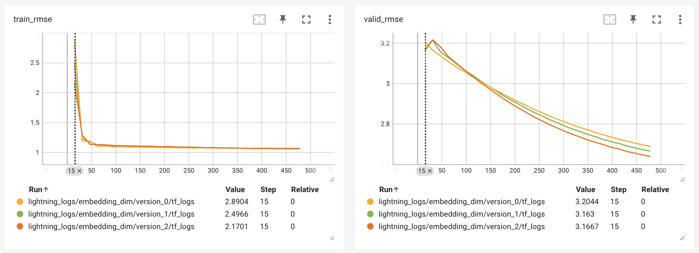

# Movielens recsys

The goal of this project is to predict how a user will rate a movie, given ratings on other movies from other users.

# Dataset

This dataset describes 5-star rating and free-text tagging activity from [MovieLens](http://movielens.org), a movie recommendation service. The dataset used in this project is the MovieLens 100k Dataset that can be found [here](https://grouplens.org/datasets/movielens/100k/).

This dataset contains 100.000 ratings from 1000 users on 1700 movies.

### Train - test split

The dataset has been splitted in training, validation and test sets in chronological order. 
- Training contains 64002 samples from 1997-09-20 to 1998-01-24
- Validation contains 16001 samples from 1998-01-24 to 1998-03-07
- Testing contains 19997 samples from 1998-03-07 to 1998-04-23

# Experiments

In this project, different models have been used to predict the ratings, among which we find MatrixFactorization and MatrixFactorizationWithBias. To determine which of them works best and which parameters are the most appropriate for each of them, a series of experiments have been carried out. The result of those experiments can be found in the `lighnings_logs/` folder.

| Model                         | tain loss 	| vald loss 	| train rmse 	| valid rmse 	|
|------------------------------ |-------------	|-------------- |--------------	|-------------- |
| MatrixFactorization 	        | 1.240       	| 11.24         | 1.1136      	| 1.800         |
| MatrixFactorizationWithBias 	| 1.09          | 6.96          | 1.04       	| 1.507         |
| NeuralCollaborativeFiltering  | 0.8305      	| 2.5212        | 0.9113        | 1.081         |

<i>
MatrixFactorization: results from lightning_logs/lr_finder/version_0</br>
MatrixFactorizationWithBias: results from lightning_logs/embedding_dim/version_2<br>
NeuralCollaborativeFiltering: results from lightning_logs/lr_finder/version_2</i><br>
</br>
Example of the experiment of the embedding_size for the model MatrixFactorixationWithBias in Tensorboard



# Installation

## Setup environment

Clone repository in a local path and you will have an structure like this

```shell clone-repo
git clone git@github.com:cespeleta/recsys-movielens.git
cd recsys-movielens
```

Install package dependencies using poetry

```shell install-packeges-with-poetry
poetry install
```

Download the dataset and store it in `input/ml-100k`. Folder structure will look like this

```shell folder-structure
├── configs
├── input
    ├── ml-100k
├── launchers
├── ...
```

# Running experiments

To launch the experiments in a simple way, bash scripts have been used that can be found in the `launchers` folder. 

For example, use the following command to execute the script that overfits one batch.

```shell run-script-01
./launchers/01_overfit_batch.sh
```

Similarly, we can find the best learning rate for each model running the following command. This script will output the results in `lighning_logs/lr_finder`

```shell run-script-01
./launchers/02_run_lr_funder.sh
```

# Notebooks

In addition to the development of the models, notebooks have also been created to analyze the input data, the output of the models and the generated embeddings.

# Next steps

- Analayze the performance of these models on other datasets, for example in the [MovieLens 25M Dataset](https://grouplens.org/datasets/movielens/)
- Convert this problem in a classification problem where classes are 1-5. Would it have better performance.
- Train the model with all the data and leave it ready for production.

# Contact ✒️

Carlos Espeleta - @Carlos_Espeleta

LinkedIn: https://www.linkedin.com/in/carlos-espeleta